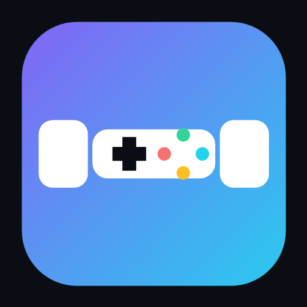

# PlayDex

A lightweight, installable web app that tracks your game sessions, playtime by game, and daily playtime goals. Everything runs locally in your browser as a single file, with optional Dropbox backup.



## Features

- **Track sessions** – start/stop a session for any game, with live elapsed time.
- **Session log** – review completed sessions with start/end times and durations.
- **Playtime by game** – see total time (and synced vs. not-synced) per game across your filtered range.
- **Daily goal** – set a playtime goal and watch today's total fill the progress bar.
- **Game library** – add, edit, and archive games.
- **Dropbox sync** – back up your data to your own Dropbox and keep multiple devices in sync.
- **Installable PWA** – install it as a standalone app on desktop or mobile.
- **Dark / light themes** – follows your preferred color scheme.

## Getting started

PlayDex is a static, self-contained app. No build step or server is required to develop it.

### Run locally

Open `index.html` directly in a browser, or serve the folder with any static server:

```bash
# Python
python -m http.server 8080

# or Node
npx serve .
```

Then visit `http://localhost:8080`.

> Data is stored in your browser's `localStorage`. To keep it across devices, enable Dropbox sync.

### PWA install

Because it's a PWA, PlayDex needs to be served over **HTTPS** (or `localhost`) for installation and the service worker to work.

- Desktop (Chrome/Edge): open the app, then click **Install app** in the header (or use the browser's install icon in the address bar).
- Mobile (iOS): open the app in Safari → **Share** → **Add to Home Screen**.
- Mobile (Android): open the app in Chrome → **Install app** (or the browser menu → *Add to Home screen*).

## Project structure

```
PlayDex/
├── index.html              # The whole app (HTML, CSS, and JS)
├── manifest.webmanifest    # PWA manifest (name, icons, display mode)
├── sw.js                   # Service worker (offline app shell + caching)
├── icon-192.png            # Install icon (192px)
├── icon-512.png            # Install icon (512px)
├── apple-touch-icon.png    # iOS home-screen icon
└── README.md
```

## Dropbox sync

The sync features need HTTPS (or `localhost`). To connect your own Dropbox account:

1. Create a Dropbox app in the [App Console](https://www.dropbox.com/developers/apps) (permission type: *App folder*).
2. Register the exact URL of this page as a **Redirect URI** for your app.
3. Enter your app key in PlayDex → **Dropbox Sync** → connect.

Your data is sent directly from your browser to Dropbox — nothing is stored on a server. For more detail, open **Dropbox Sync** inside the app.

## License

This project is for personal/portfolio use. No warranty is provided.